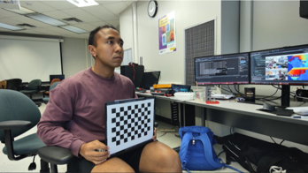
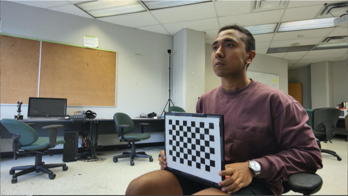

# Live 3D Reconstruction Demo

## Description
This project showcases real-time point cloud fusion of multiple RGB-D cameras using 2D marker based calibration.

---

## Demos
### Video 1: [Point Cloud Reconstruction Accuracy]
The designed algorithm yielded a 90% reconstruction accuracy compared to manual scans.

  
The following images were used for reconstruction:

  
  

### Video 2: [Live Reconstruction Demo]
This demo showcases the reconstruction accuracy of the algorithm when deployed to live video. In this demo, two Intel Realsense L515 cameras were used.

### Video 3: [Camera Extrinsic Location]
This demo illustrates the resulting camera extrinsics obtaind from the calibration. This demo was created using Unreal Engine 5, and displayed on the Varjo XR3 headset.

---

## Contact
This project showcases my ongoing work with VeyondMetaverse. For further details or inquiries, feel free to reach out to me at nkarki@torontomu.ca.

